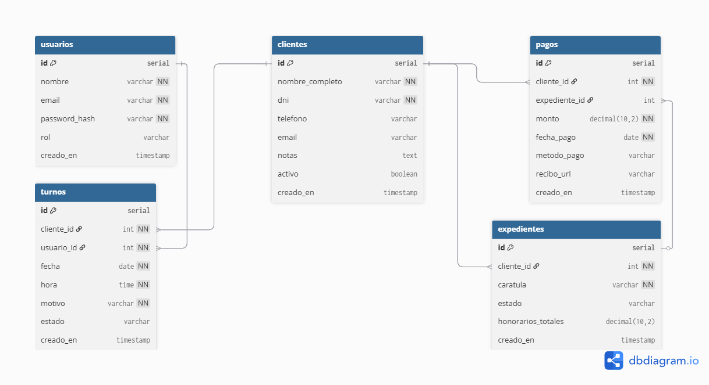

# ⚖️ Gestión Integral de Estudio Jurídico


*(Reemplaza el archivo `./docs/portada.png` con un screenshot general de tu Dashboard)*

Un sistema web completo diseñado para digitalizar la gestión diaria de un estudio de abogados. La plataforma centraliza la administración de clientes, el seguimiento de expedientes judiciales, la agenda de audiencias y un robusto sistema financiero para el control de honorarios y planes de cuotas.

Este proyecto fue desarrollado bajo el patrón de arquitectura **MVC (Model-View-Controller)** y presenta un backend robusto en Node.js que alimenta a un frontend dinámico construido exclusivamente con tecnologías nativas web (Vanilla JS).

---

## ✨ Características Principales

### 📊 Dashboard y Analíticas
Panel de control gerencial que muestra métricas en tiempo real. 
- Cálculo del capital total "en la calle" (suma de todos los honorarios adeudados).
- Ranking automático de deudores urgentes.
- Visualización rápida de los próximos turnos y audiencias.
>  *(Agrega tu captura aquí)*

### 💰 Gestión Financiera y Cuentas Corrientes
Sistema a prueba de errores para el seguimiento de la facturación.
- Asignación de honorarios totales por expediente judicial.
- **Pagos ciegos** y sistema automático de deducción de deuda.
- Configuración de **Planes de Cuotas** que calcula automáticamente el valor por cuota y la cantidad de cuotas abonadas en base a los ingresos.
>  *(Agrega tu captura aquí)*

### 📁 Expedientes y Causas Judiciales
Organización estructurada del trabajo legal.
- Relación de uno a muchos entre clientes y causas legales.
- Módulo integrado para la subida y almacenamiento en la nube de documentos probatorios en formato PDF.
- Sistema de *Notas Rápidas* para asentar avances diarios del caso.
>  *(Agrega tu captura aquí)*

### 📅 Agenda Legal
Calendario interactivo para la organización del tiempo del estudio.
- Creación, modificación y cancelación de audiencias, reuniones y vencimientos procesales.

### 🔒 Seguridad y Auditoría
- Autenticación manejada mediante **JSON Web Tokens (JWT)**.
- Encriptado de contraseñas de usuarios usando **Bcryptjs**.
- Registro automático de logs de actividad para auditar qué usuario realizó cada acción en el sistema.

---

## 🛠️ Stack Tecnológico

**Frontend (Client-Side):**
- HTML5 semántico
- CSS3 puro (Grid, Flexbox, variables CSS)
- JavaScript Vanilla (Consumo asíncrono de API REST vía Fetch API)

**Backend (Server-Side):**
- Node.js
- Express.js (Enrutamiento y middlewares)
- Multer (Procesamiento de archivos multipart/form-data)
- Autenticación JWT y Bcryptjs

**Base de Datos & Cloud:**
- **PostgreSQL** alojado y gestionado a través de **Supabase**.
- Almacenamiento de archivos (Storage) en buckets de Supabase.

---

## 🏛️ Arquitectura del Proyecto

El código fuente está estructurado bajo principios de separación de responsabilidades, facilitando la escalabilidad y el mantenimiento:

```text
/
├── public/          # Frontend desacoplado (HTML, CSS y Vanilla JS agrupados por módulo)
├── src/
│   ├── config/      # Conexiones externas (DB Supabase)
│   ├── middlewares/ # Validadores de seguridad (Ej. verificación de Token JWT)
│   ├── models/      # Clases POO y capa de acceso a datos (Lógica de negocio y SQL)
│   ├── routes/      # Controladores y definición de endpoints de la API REST
│   └── utils/       # Funciones transversales (Ej. Logger de auditoría)
├── docs/            # Documentación técnica, DER y assets visuales
└── server.js        # Punto de entrada de la aplicación Express
```

---

## 🚀 Instalación y Uso Local

Sigue estos pasos para levantar el entorno de desarrollo local:

1. **Clonar el repositorio:**
   ```bash
   git clone https://github.com/tu-usuario/gestion-estudio-juridico.git
   cd gestion-estudio-juridico
   ```

2. **Instalar dependencias:**
   ```bash
   npm install
   ```

3. **Configurar variables de entorno:**
   Copia el archivo `.env.example` y renómbralo a `.env`. Completa las credenciales de Supabase y tu secreto JWT:
   ```env
   PORT=3000
   SUPABASE_URL=tu_supabase_url
   SUPABASE_KEY=tu_supabase_anon_key
   JWT_SECRET=tu_secreto_super_seguro
   ```

4. **Ejecutar el servidor en modo desarrollo:**
   ```bash
   npm run dev
   ```

5. **Acceder a la plataforma:**
   Abre tu navegador en `http://localhost:3000/login.html`

---

## 🗄️ Esquema de Base de Datos (DER)

A continuación, se adjunta el Diagrama de Entidad-Relación diseñado para estructurar el modelo de datos robusto de este sistema.



---

*Desarrollado de manera independiente como solución freelance.*